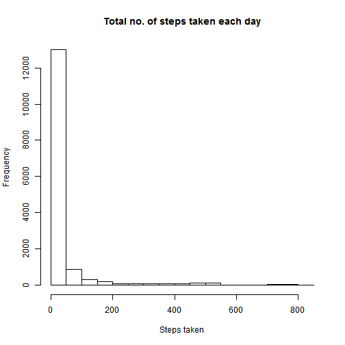
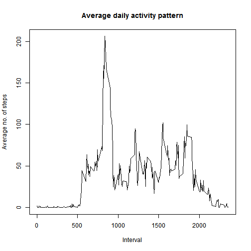
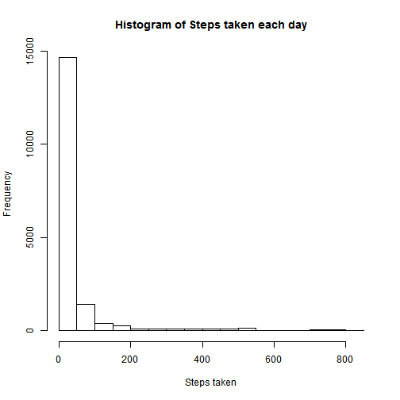
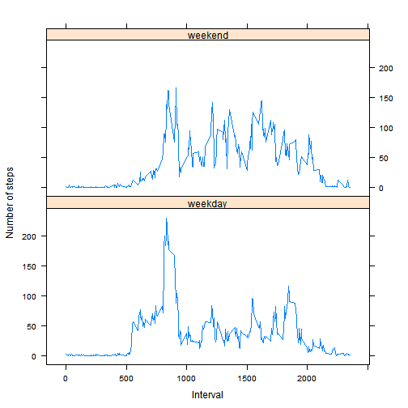

Coursera Reproducible Research: Peer Assesment 1
===============================================

  
## Loading and preprocessing the data

Load the data:

```r
activity.data <- read.csv("data/activity.csv")
```

Change `date` variable from factor to date

```r
activity.data$date <- as.Date(activity.data$date)
```


  
## What is mean total number of steps taken per day?

Make a histogram of the total number of steps taken each day:

```r
hist(activity.data$steps, main = "Total no. of steps taken each day", xlab = "Steps taken")
```

 


Calculate the mean and median of total number of steps taken per day:

```r
mean(activity.data$steps, na.rm = TRUE)
```

```
## [1] 37.38
```

```r
median(activity.data$steps, na.rm = TRUE)
```

```
## [1] 0
```


  
## What is the average daily activity pattern?

Calculate average number of steps taken by interval:

```r
steps.ave <- tapply(activity.data$steps, activity.data$interval, mean, na.rm = TRUE)
steps.ave <- as.numeric(steps.ave)
```


Make a time series plot:

```r
plot(steps.ave ~ activity.data$interval[1:288], type = "l", main = "Average daily activity pattern", 
    xlab = "Interval", ylab = "Average no. of steps")
```

 


Interval which conatains the maximum numbers of steps is:

```r
activity.data$interval[which.max(steps.ave)]
```

```
## [1] 835
```


  
## Imputing missing values

Calculate the total number of missing values in the dataset:

```r
sum(is.na(activity.data))
```

```
## [1] 2304
```


Replace missing values in the dataset with the mean for respective 5-minute interval:

```r
ave.steps.int <- rep(steps.ave, 61)
new.activity.data <- cbind(activity.data, ave.steps.int)

for (i in 1:nrow(new.activity.data)) {
    
    if (is.na(new.activity.data[i, 1])) {
        
        new.activity.data[i, 1] <- new.activity.data[i, 4]
        
    }
    
}
```


Create a new dataset that is equal to the original dataset but with the missing data filled in: 

```r
new.activity.data <- new.activity.data[, -4]
head(activity.data)
```

```
##   steps       date interval
## 1    NA 2012-10-01        0
## 2    NA 2012-10-01        5
## 3    NA 2012-10-01       10
## 4    NA 2012-10-01       15
## 5    NA 2012-10-01       20
## 6    NA 2012-10-01       25
```

```r
head(new.activity.data)
```

```
##     steps       date interval
## 1 1.71698 2012-10-01        0
## 2 0.33962 2012-10-01        5
## 3 0.13208 2012-10-01       10
## 4 0.15094 2012-10-01       15
## 5 0.07547 2012-10-01       20
## 6 2.09434 2012-10-01       25
```


Make a histogram of the total number of steps taken each day:

```r
hist(new.activity.data$steps, main = "Histogram of Steps taken each day", xlab = "Steps taken")
```

 


Calculate the mean and median of total number of steps taken per day:

```r
mean(new.activity.data$steps)
```

```
## [1] 37.38
```

```r
median(new.activity.data$steps)
```

```
## [1] 0
```


Do these values differ from the estimates from the first part of the assignment? **No**  
What is the impact of imputing missing data on the estimates of the total daily number of steps? **There is none**

  
## Are there differences in activity patterns between weekdays and weekends?

Create a new factor variable in the dataset with two levels - "weekday" and "weekend" indicating whether a given date is a weekday or weekend day:

```r
for (i in 1:nrow(new.activity.data)) {
    
    if (weekdays(new.activity.data[i, 2]) == "Saturday" | weekdays(new.activity.data[i, 
        2]) == "Sunday") {
        
        new.activity.data[i, 4] <- "weekend"
        
    } else {
        
        new.activity.data[i, 4] <- "weekday"
        
    }
    
}

names(new.activity.data)[4] <- "day.type"
new.activity.data$day.type <- as.factor(new.activity.data$day.type)
```


Transform dataset for easier ploting:

```r
# Split dataset by day.type (weekday and weekend datasets)
split.activity <- split(new.activity.data, new.activity.data$day.type)
weekday <- split.activity[[1]]
weekend <- split.activity[[2]]

# Calculate average number of steps taken by interval for weekdays
steps.weekday <- tapply(weekday$steps, weekday$interval, mean, na.rm = TRUE)

# Calculate average number of steps taken by interval for weekends
steps.weekend <- tapply(weekend$steps, weekend$interval, mean, na.rm = TRUE)

# Create new dataset for xyplot() function
steps.weekday <- as.numeric(steps.weekday)
steps.weekend <- as.numeric(steps.weekend)

steps.weekday.int <- data.frame(steps = steps.weekday, interval = new.activity.data$interval[1:288], 
    day.type = rep("weekday", 288))
steps.weekend.int <- data.frame(steps = steps.weekend, interval = new.activity.data$interval[1:288], 
    day.type = rep("weekend", 288))

activity.day.type <- rbind(steps.weekday.int, steps.weekend.int)
```


Make a panel plot:

```r
library(lattice)
xyplot(activity.day.type$steps ~ activity.day.type$interval | activity.day.type$day.type, 
    type = "l", xlab = "Interval", ylab = "Number of steps", layout = c(1, 2))
```

 

